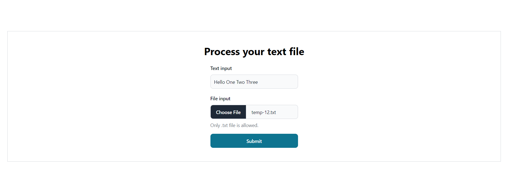
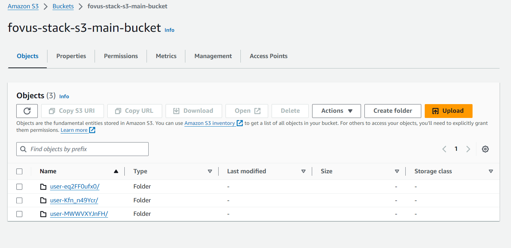
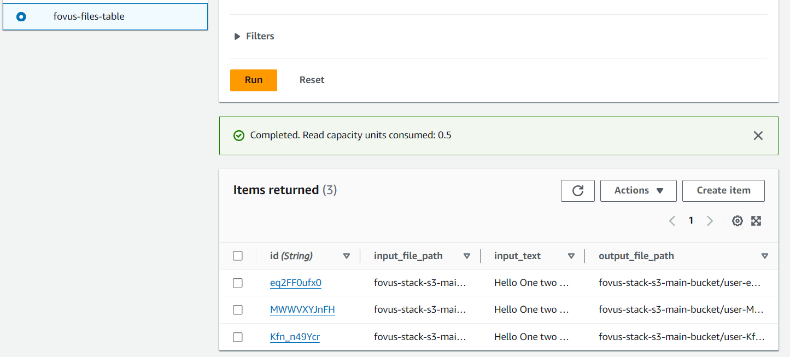
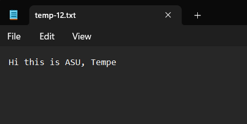
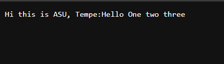

## Prerequisite Setup

Before running this project, ensure you have the following prerequisites installed and set up:

1. **Create an AWS Account**: If you don't have an AWS account, you can create one at [https://aws.amazon.com/](https://aws.amazon.com/). Follow the instructions provided to set up your account.

2. **Configure AWS CLI**: Once you have an AWS account, install AWS CLI on your local machine if you haven't already [Refer this link to install AWS CLI](https://docs.aws.amazon.com/cli/latest/userguide/getting-started-install.html). Then generate IAM User for AWS CLI with **AdministratorAccess** policy [Refer this article](https://medium.com/@sam.xzo.developing/create-aws-iam-user-02ee9c65c877).Then, configure access ID and Key to AWS CLI:
    ```
    aws configure
    ```
    Follow the prompts to enter your Access Key ID, Secret Access Key, default region `'us-east-2'`, and output format. These credentials should belong to an IAM user with administrative access created previously.


3. **Node.js**: Install Node.js from [https://nodejs.org/](https://nodejs.org/) if you haven't already. This project requires Node.js for running scripts and managing dependencies.

4. **AWS CDK**: Install AWS Cloud Development Kit (CDK) for TypeScript globally using npm by running the following command:
    ```
    npm install -g typescript aws-cdk
    ```

5. **Bootstrap CDK (First-Time Setup)**: If this is your first time using AWS CDK in your AWS account, you need to bootstrap your environment. Run the following command:
    ```
    cdk bootstrap
    ```

## Installation

Once you have set up the prerequisites, follow these steps to install and run the project:

1. **Clone Repository**: Clone this repository to your local machine.

2. **Navigate to Root Folder**: Open a command prompt or terminal and navigate to the root folder of the cloned repository.

3. **Windows**: If you're using Windows, run the `run.bat` file located in the root folder. You can do this by double-clicking the `run.bat` file or executing it from the command prompt.

4. **Linux/Unix**: If you're using Linux or Unix-based system, run the following commands to make the `run.sh` script executable and then execute it:
    ```
    chmod +x ./run.sh
    ./run.sh
    ```

5. **Access UI**: After running the script, backend will be deployed to AWS and the UI will be accessible at [http://localhost:5173/](http://localhost:5173/). Open your web browser and navigate to this URL to access the user interface.

## Cleanup

To clean up all AWS resources created by this project, follow these steps:

1. **Stop Frontend Dev Server**: Press `Ctrl + C` to stop the frontend development server running locally.

2. **Navigate to cdk-setup Folder**: Open a command prompt or terminal and navigate to the `/cdk-setup` folder within your project directory.

3. **Run CDK Destroy**: Once inside the `/cdk-setup` folder, run the following command to destroy all AWS stacks created by CDK:
    ```
    cdk destroy
    ```

## About This Code Repository

- **cdk-setup/**: Contains code for AWS CDK stack.
- **focus-frontend/**: TypeScript React UI developed using Vite.
- **lambda-functions/**: Contains required Lambda functions.
    - **create-ec2-func/**: Contains the function to create EC2 instances to process user input.
    - **s3-presigned-url-func/**: Generates presigned URLs to upload text files.
    - **dynamodb-func/**: Stores user input to DynamoDB.
- **screenshots/**: Contains screenshots of the actual UI.

## Screenshots
### Home Page
 

### File added to S3 bucket


### Dyanamodb records


### Input File


## Processed Output File



## References

- **AWS References**
    - AWS SDK (Javascript v3) - https://github.com/awsdocs/aws-doc-sdk-examples/tree/main/javascriptv3
    - AWS CDK - https://docs.aws.amazon.com/cdk/api/v2/
    - S3 Presigned URL - https://allardqjy.medium.com/using-pre-signed-urls-to-upload-files-to-amazon-s3-from-reactjs-5b15c94b66df
    - Dyanamodb Stream - https://docs.aws.amazon.com/amazondynamodb/latest/developerguide/Streams.Lambda.html
    - AWS Lambda Filter - https://stackoverflow.com/questions/41112362/configure-dynamodb-stream-trigger-with-insert-only
    - Node.js Lambda Deployment - https://docs.aws.amazon.com/lambda/latest/dg/nodejs-package.html
    - Role vs InstanceProfile - https://medium.com/devops-dudes/the-difference-between-an-aws-role-and-an-instance-profile-ae81abd700d#:~:text=Roles%20are%20designed%20to%20be,instance%20profile%20represents%20EC2%20instances.
    - Self Terminating Instance - https://stackoverflow.com/questions/10541363/self-terminating-aws-ec2-instance?noredirect=1&lq=1
    - S3 Bucket deletion on CDK Destroy - https://stackoverflow.com/questions/70730645/s3-bucket-is-not-removed-by-cdk-destroy
    - Read CDK output - https://stackoverflow.com/questions/60633269/how-to-get-cfnoutputs-of-aws-stack-to-a-file-using-aws-cdk
    - EC2 Metadata - https://medium.com/@radhagayathripatel/retrieving-aws-ec2-instance-metadata-using-metadata-in-scripts-251bf18dbabf

- **Frontend References**

    - Flowbite-react - https://flowbite-react.com/docs/getting-started/introduction
    - Vite - https://vitejs.dev/guide/


